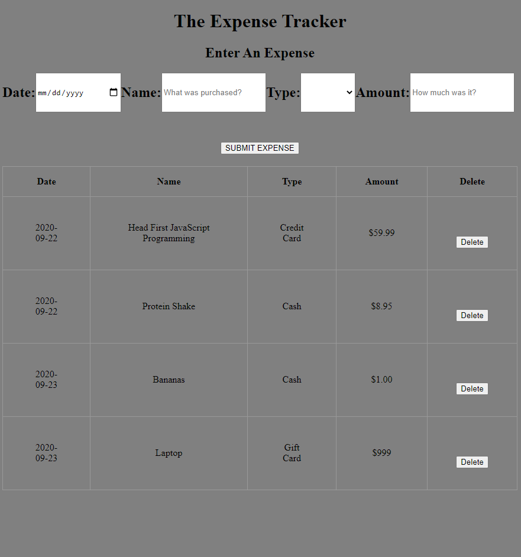

# Expense Tracker

Expense Tracker created with HTML, CSS and JavaScript

Click [here](https://jbri91.github.io/expense_tracker/) to track your expenses.

# Summary
I enjoyed this project. When I first looked at it, it was abit intimidating. I broke it down into parts and focused on each of them individually. That made it a lot easier to put together. It was interesting to work with a table this time around but as I learn more I realize the principles carry over very well. For example, adding or removing a parent element or using the id's, class names or tag names in order to manipulate the DOM. That helped me get a better understanding of those as well as how they work especially dealing with parent and child elements. 

# Author
* Johnny Redry Briones Jr. - *Programmer*